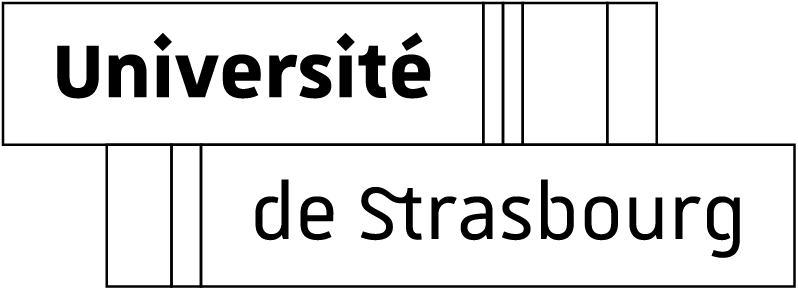

<div align="center">
<a href="http://camma.u-strasbg.fr/">

</a>
</div>

------------------------------------------------------

<div align="right">
  <a href="docs/README-Format.md" id="links">Data format</a> &nbsp;&nbsp;&nbsp; | &nbsp;&nbsp;&nbsp; 
  <a href="docs/README-Splits.md" id="links">Data splits</a>  &nbsp;&nbsp;&nbsp; | &nbsp;&nbsp;&nbsp; 
  <a href="docs/README-Downloads.md" id="links">Downloads</a>  &nbsp;&nbsp;&nbsp; | &nbsp;&nbsp;&nbsp; 
  <a href="docs/README-Loader.md" id="links">Data loader</a>  &nbsp;&nbsp;&nbsp; | &nbsp;&nbsp;&nbsp;
  <a href="docs/README-Challenges.md" id="links">Challenges</a> &nbsp;&nbsp;&nbsp; | &nbsp;&nbsp;&nbsp;  
  <a href="docs/README-Leaderboards.md" id="links">Leaderboards</a> 
</div>

------------------------------------------------------
<br>


# Highlights
The CholecT50 dataset can support the following research:
1. Surgical action triplet recognition
2. Surgical action triplet detection/localization
3. Surgical tool presence detection
4. Surgical tool detection/localization
5. Surgical action/verb recognition
6. Surgical target recognition
7. Surgical phase recognition
* Any combination of the above

<br>


# News
- &#x2612; [ **20/02/2023** ]: CholecT50 dataset is released for public use under CC BY-NC-SA 4.0 Licence.
- &#x2612; [ **30/11/2022** ]: CholecTriplet2021 challenge joint [paper](https://arxiv.org/abs/2204.04746) accepted at Medical Image Analysis journal. 
- &#x2612; [ **29/04/2022** ]: Added PyTorch dataloader for the dataset.
- &#x2610; [ **02/05/2022** ]: Added TensorFlow v1 & v2 dataloader for the dataset.
- &#x2612; [ **12/02/2022** ]: Official splits of the dataset for developing deep learning models is contained in [arxiv](https://arxiv.org/abs/2204.05235).
- &#x2612; [ **12/02/2022** ]: CholecT45 dataset is released for public use under CC BY-NC-SA 4.0 Licence.


<!-- - &#x2612; [ **18/09/2022** ]: CholecTriplet2022 challenge results announced. Check out the [results and winners](https://cholectriplet2022.grand-challenge.org/results). -->

<br>

------------------------------------------------
Cholecystectomy Action Triplet Dataset
================================================

<b>CholecT50</b> is a dataset of endoscopic videos of laparoscopic cholecystectomy surgery introduced to enable research on fine-grained action recognition in laparoscopic surgery. 
The videos are collected in Strasbourg, France.
The images are extracted at 1 fps from the videos and annotated with triplet information about surgical actions in the format of  `<instrument, verb, target>`. 
The phase labels are also provided. 
Spatial annotations in the form of bounding boxes over the instrument tips are provided for 5 videos. 
The box-triplet matching labels are also provided for all bounding box annotations.
The dataset is a collection of 50 videos consisting of 45 videos from the Cholec80 [[1]](#cite-cholec80) dataset and 5 videos from the superset in-house Cholec120 [[6]](#cite-cholec120) dataset of the same surgical procedure.

<b>CholecT40</b> [[2]](#cite-cholect40) is the first effort of creating surgical action triplet dataset consisting of 40 videos.
CholecT50 [[3]](#cite-cholect50) is an extension of CholecT40 with 10 additional videos and standardized classes.

<b>CholecT45</b> [[3]](#cite-cholect50) is a subset of CholecT50 consisting of 45 videos from the Cholec80 dataset and first public release of CholecT50.
CholecT50 is the super set of CholecT45 and CholecT40 datasets.

<div align="right">

[](docs/README-Downloads.md)

</div>

## <u>Dataset Examples</u>

Some example images with overlay of their labels. 


<br>


## <u>Dataset Variants</u>

The following are the official variants of the dataset:

1. **CholecT50 (cross-val): the official cross validation split of CholecT50** [[3]](#cite-cholect50). (`recommended`)
2. **CholecT50 (challenge) : the variant used in CholecTriplet challenges**  [[4](#cite-ct2021),  [5](#cite-ct2022)] (`recommended`).
3. CholecT50 : the original version as used in the Rendezvous publication [[3]](#cite-cholect50).
4. CholecT45 (cross-val): the official cross validation split of CholecT45 [[3]](#cite-cholect50).
5. CholecT40 : the original version of CholecT40 as used in Tripnet publication [[2]](#cite-cholect40).

For research purposes, we recommend the use of the **CholecT50 (cross-val)** version because it is complete and supports the evaluation of all the 100 triplet classes via k-fold cross-validation. Researchers can additionally use the **CholecT50 (challenge)** version to compare with the results presented at the CholecTriplet challenges. 

We have provided bechmark results of baseline models and show how they compare across the above listed versions of the datasets in [[6]](#cite-split).

<br>

## <u>Research Papers</u>

This dataset could only be generated thanks to the continuous support from our surgical partners. In order to properly credit the authors and clinicians for their efforts, you are kindly requested to cite the work that led to the generation of this dataset:

> For **CholecT45 and CholecT50:** 
- [[3]](#cite-cholect50) C.I. Nwoye, T. Yu, C. Gonzalez, B. Seeliger, P. Mascagni, D. Mutter, J. Marescaux, N. Padoy. Rendezvous: Attention Mechanisms for the Recognition of Surgical Action Triplets in Endoscopic Videos. Medical Image Analysis, 78 (2022) 102433. \
   [](https://doi.org/10.1016/j.media.2022.102433)
   [](https://arxiv.org/abs/2109.03223) 
   [](https://github.com/CAMMA-public/rendezvous)
   [](https://www.youtube.com/watch?v=d_yHdJtCa98&t=61s)

<br>

> For **CholecT40:**
- [[2]](#cite-cholect40) C.I. Nwoye, C. Gonzalez, T. Yu, P. Mascagni, D. Mutter, J. Marescaux, N. Padoy. Recognition of instrument-tissue interactions in endoscopic videos via action triplets. International Conference on Medical Image Computing and Computer-Assisted Intervention (MICCAI), LNCS 12263(2020) 364-374. \
  [](https://link.springer.com/chapter/10.1007/978-3-030-59716-0_35)
  [](https://arxiv.org/abs/2007.05405)
  [](https://github.com/CAMMA-public/tripnet)

<br>

<!---
## Contributors

- Chinedu Nwoye
- Tong Yu
- Cristians Gonzalez
- Barbara Seeliger
- Pietro Mascagni
- Nicolas Padoy
-->
<br>


------------------------------------------------
License
================================================

The cholecT50 dataset is publicly released under the Creative Commons license [CC BY-NC-SA 4.0 LICENSE](https://creativecommons.org/licenses/by-nc-sa/4.0/) . This implies that:

- the dataset cannot be used for commercial purposes,
- the dataset can be transformed (additional annotations, etc.),
- the dataset can be redistributed as long as it is redistributed under the same [license](LICENSE) with the obligation to cite the contributing work which led to the generation of the cholecT45 dataset (mentioned above).

By downloading and using this dataset, you agree on these terms and conditions.


<div align="right">

[](docs/README-Downloads.md)

</div>


------------------------------------------------
Acknowledgement
================================================

This work was supported by French state funds managed by BPI France (project CONDOR, Project 5G-OR) and by the ANR (Labex CAMI, IHU Strasbourg, project DeepSurg, National AI Chair AI4ORSafety). We also thank the research teams of IHU and IRCAD for their help with the initial annotation of the dataset during the CONDOR project.

<br><br>
 



<br>

<br><br>

------------------------------------------------
Contact
================================================

This dataset is maintained by the research group CAMMA: http://camma.u-strasbg.fr

Any updates regarding this dataset can be found here: http://camma.u-strasbg.fr/datasets

Any questions regarding the dataset can be sent to: camma.dataset@gmail.com

<br>

------------------------------------------------
References
================================================
<div id="cite-cholec80">

* **[1]** A.P. Twinanda, S. Shehata, D. Mutter, J. Marescaux, M. de Mathelin, N. Padoy. EndoNet: A Deep Architecture for Recognition Tasks on Laparoscopic Videos. IEEE Trans. on Medical Imaging 2016.
  ```
  @article{twinanda2016endonet,
    title={Endonet: a deep architecture for recognition tasks on laparoscopic videos},
    author={Twinanda, Andru P and Shehata, Sherif and Mutter, Didier and Marescaux, Jacques and De Mathelin, Michel and Padoy, Nicolas},
    journal={IEEE transactions on medical imaging},
    volume={36},
    number={1},
    pages={86--97},
    year={2016}
  }
  ```
  <div align="right">

    [](https://ieeexplore.ieee.org/abstract/document/7519080)
    [](https://arxiv.org/abs/1602.03012)   
  </div><br></div>

<div id="cite-cholect40">

* **[2]** C.I. Nwoye, T. Yu, C. Gonzalez, P. Mascagni, D. Mutter, J. Marescaux, N. Padoy. Recognition of instrument-tissue interactions in endoscopic videos via action triplets.International Conference on Medical Image Computing and Computer-Assisted Intervention (MICCAI) 2020.
  ```
  @inproceedings{nwoye2020recognition,
     title={Recognition of instrument-tissue interactions in endoscopic videos via action triplets},
     author={Nwoye, Chinedu Innocent and Gonzalez, Cristians and Yu, Tong and Mascagni, Pietro and Mutter, Didier and Marescaux, Jacques and Padoy, Nicolas},
     booktitle={International Conference on Medical Image Computing and Computer-Assisted Intervention (MICCAI)},
     pages={364--374},
     year={2020},
     organization={Springer}
  }
  ```
  <div align=right>

  [](https://link.springer.com/chapter/10.1007/978-3-030-59716-0_35)
  [](https://arxiv.org/abs/2007.05405)
  [](https://github.com/CAMMA-public/tripnet)
  </div><br></div>

<div id="cite-cholect50">

* **[3]** C.I. Nwoye, T. Yu, C. Gonzalez, B. Seeliger, P. Mascagni, D. Mutter, J. Marescaux, N. Padoy. Rendezvous: Attention Mechanisms for the Recognition of Surgical Action Triplets in Endoscopic Videos. Medical Image Analysis 2022.
  ```
  @article{nwoye2021rendezvous,
    title={Rendezvous: Attention Mechanisms for the Recognition of Surgical Action Triplets in Endoscopic Videos},
    author={Nwoye, Chinedu Innocent and Yu, Tong and Gonzalez, Cristians and Seeliger, Barbara and Mascagni, Pietro and Mutter, Didier and Marescaux, Jacques and Padoy, Nicolas},
    journal={Medical Image Analysis},
    volume={78},
    pages={102433},
    year={2022}
  }
  ```
  <div align=right>

   [](https://doi.org/10.1016/j.media.2022.102433)
   [](https://arxiv.org/abs/2109.03223) 
   [](https://github.com/CAMMA-public/rendezvous)
   [](https://www.youtube.com/watch?v=d_yHdJtCa98&t=61s)
   </div><br></div>

<div id="cite-ct2021">

* **[4]** C.I. Nwoye, D. Alapatt, T. Yu, A. Vardazaryan, F. Xia, ... , D. Mutter, N. Padoy. CholecTriplet2021: A benchmark challenge for surgical action triplet recognition. arXiv PrePrint arXiv:2204.04746. Medical Image Analysis 2022.
  ```
  @article{nwoye2022cholectriplet2021,
    title={CholecTriplet2021: a benchmark challenge for surgical action triplet recognition},
    author={Nwoye, Chinedu Innocent and Alapatt, Deepak and Vardazaryan, Armine ... Gonzalez, Cristians and Padoy, Nicolas},
    journal={arXiv preprint arXiv:2204.04746},
    year={2022}
  }
  ```
<div align="right">

  [](https://arxiv.org/abs/2204.04746)  
      
 </div><br></div>


<div id="cite-ct2022">

* **[5]** C.I. Nwoye, T. Yu, S. Sharma, A. Murali, D. Alapatt A. Vardazaryan, K. Yuan, ... , D. Mutter, N. Padoy. CholecTriplet2022: Show me a tool and tell me the triplet: an endoscopic vision challenge for surgical action triplet detection. arXiv PrePrint arXiv:2204.14746. 2023.
  ```  
  @article{nwoye2023cholectriplet2022,
    title={CholecTriplet2022: Show me a tool and tell me the triplet: an endoscopic vision challenge for surgical action triplet detection.},
    author={Nwoye, Chinedu Innocent and Yu, Tong and Sharma, Saurav and Murali, Aditya and Alapatt, Deepak and Vardazaryan, Armine ... Gonzalez, Cristians and Padoy, Nicolas},
    journal={arXiv preprint arXiv:2204.14746},
    year={2023}
  }
  ```
  <div align="right">

    [](https://arxiv.org/abs/2204.04746)   
  </div><br></div>


<div id="cite-split">

* **[6]** C.I. Nwoye, N. Padoy. Data Splits and Metrics for Benchmarking Methods on Surgical Action Triplet Datasets. arXiv PrePrint arXiv:2204.05235. 2022.  
  ```
  @article{nwoye2022data,
    title={Data Splits and Metrics for Benchmarking Methods on Surgical Action Triplet Datasets},
    author={Nwoye, Chinedu Innocent and Padoy, Nicolas},
    journal={arXiv preprint arXiv:2204.05235},
    year={2022}
  }
  ```
  <div align="right">
  
    [](https://arxiv.org/abs/2204.05235) 
  </div>
</div>


<div id="cite-cholec120">

* **[7]** http://camma.u-strasbg.fr/datasets
</div>

---------------

<div align="right">

[Download page](docs/README-Downloads.md)
</div>