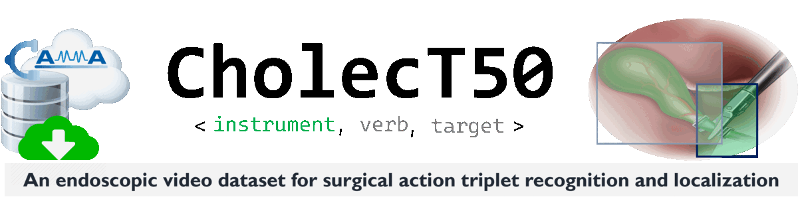

<div align="center">
<a href="http://camma.u-strasbg.fr/">

</a>
</div>

------------------------------------------------------

<div align="right"><a href="../README.md" id="links">Home</a> &nbsp;&nbsp;&nbsp; | &nbsp;&nbsp;&nbsp; 
<a href="README-Format.md" id="links">Data format</a> &nbsp;&nbsp;&nbsp; | &nbsp;&nbsp;&nbsp; 
<a href="README-Splits.md" id="links">Data splits</a>  &nbsp;&nbsp;&nbsp; | &nbsp;&nbsp;&nbsp; 
<a href="README-Downloads.md" id="links">Downloads</a>  &nbsp;&nbsp;&nbsp; | &nbsp;&nbsp;&nbsp; 
<a href="README-Loader.md" id="links">Data loader</a>  &nbsp;&nbsp;&nbsp; | &nbsp;&nbsp;&nbsp; 
<a href="README-Challenges.md" id="links">Challenges</a>  &nbsp;&nbsp;&nbsp; | &nbsp;&nbsp;&nbsp; </div>

------------------------------------------------------
<br>


Leaderboard
================================================

The leaderboard is for the global tracking of model performance on the datasets:

1. CholecT50 : [view](https://paperswithcode.com/sota/action-triplet-recognition-on-cholect50)
2. CholecT50 (challenge - recognition) : [view](https://paperswithcode.com/sota/action-triplet-recognition-on-cholect50-1)
2. CholecT50 (challenge - detection) : [view]()
3. CholecT50 (cross-val): [view](https://paperswithcode.com/sota/action-triplet-recognition-on-cholect50-cross-1)
4. CholecT45 (cross-val): [view](https://paperswithcode.com/sota/action-triplet-recognition-on-cholect45)
5. CholecT40 : [view](https://paperswithcode.com/sota/action-triplet-recognition-on-cholect40)

<br>

## Inclusion in the leaderboard
Published and arXiv papers following any of the official data splits [[1]](#cite-split) will be automatically updated on the leaderboard by `paperswithcode`.
- Ensure you specify the correct variant of the dataset used and follow the official split.
- Ensure you compare your method with only the results from methods evalauted on the same variant of the dataset.


<br>


------------------------------------------------
References
================================================


<div id="cite-split">

* **[1]** C.I. Nwoye, N. Padoy. Data Splits and Metrics for Benchmarking Methods on Surgical Action Triplet Datasets. arXiv PrePrint arXiv:2204.05235. 2022.
  ```
  @article{nwoye2022data,
    title={Data Splits and Metrics for Benchmarking Methods on Surgical Action Triplet Datasets},
    author={Nwoye, Chinedu Innocent and Padoy, Nicolas},
    journal={arXiv preprint arXiv:2204.05235},
    year={2022}
  }
  ```
  <div align="right">

    [](https://arxiv.org/abs/2204.05235)  
  </div>
  <br>
</div>