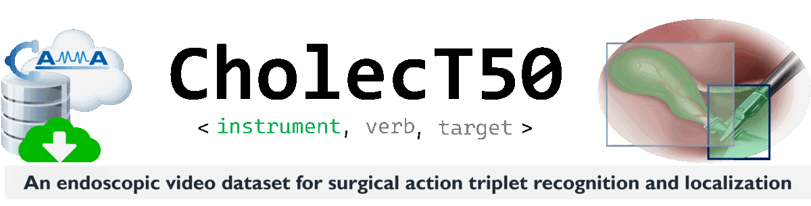
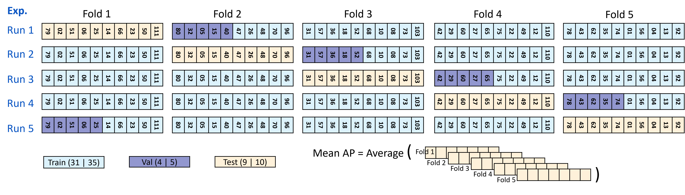

<div align="center">
<a href="http://camma.u-strasbg.fr/">

</a>
</div>

------------------------------------------------------

<div align="right"><a href="../README.md" id="links">Home</a> &nbsp;&nbsp;&nbsp; | &nbsp;&nbsp;&nbsp; 
<a href="README-Format.md" id="links">Data format</a> &nbsp;&nbsp;&nbsp; | &nbsp;&nbsp;&nbsp; 
<a href="README-Downloads.md" id="links">Downloads</a>  &nbsp;&nbsp;&nbsp; | &nbsp;&nbsp;&nbsp; 
<a href="README-Loader.md" id="links">Data loader</a>  &nbsp;&nbsp;&nbsp; | &nbsp;&nbsp;&nbsp; 
<a href="README-Challenges.md" id="links">Challenges</a>  &nbsp;&nbsp;&nbsp; | &nbsp;&nbsp;&nbsp;  
<a href="README-Leaderboards.md" id="links">Leaderboards</a> </div>

------------------------------------------------------
<br>


Dataset Splits and Baselines
================================================

The official splits of the datasets for deep learning models are provided in the paper [[1]](#cite-split):
The paper provides extended experiments on the baseline methods using the official dataset splits.


<!--  -->


**Fig. 1**: Cross-validation experiment schedule for CholecT50. <i>For CholecT45, remove the last video in each fold. The number in each box represents the video ID. </i>. 

<br>

## Video Overlap

- As the dataset is from CAMMA research group, University of Strasbourg, France, there are possible video overlaps in other cholecystectomy datasets such as Cholec80, Cholec120, M2CAI16, etc.
- The video IDs (e.g. `1, 2, 5, 80`, etc.) are consistent across these datasets. The prefix `"VID"` in the video filenames (e.g. `VID01, VID02, VID80`, etc.) are sometimes written as `"Video"` in other datasets (e.g. `Video01, Video80`, etc. )
- Researchers are advised to take into consideration the overlapping videos when pre-training their models on other cholecystectomy datasets.


<br>


------------------------------------------------
References
================================================
<div id="cite-split">

* **[1]** C.I. Nwoye, N. Padoy. Data Splits and Metrics for Benchmarking Methods on Surgical Action Triplet Datasets. arXiv PrePrint arXiv:2204.05235. 2022.  
  ```
  @article{nwoye2022data,
    title={Data Splits and Metrics for Benchmarking Methods on Surgical Action Triplet Datasets},
    author={Nwoye, Chinedu Innocent and Padoy, Nicolas},
    journal={arXiv preprint arXiv:2204.05235},
    year={2022}
  }
  ```
  <div align="right">
  
    [](https://arxiv.org/abs/2204.05235) 
  </div>
</div>